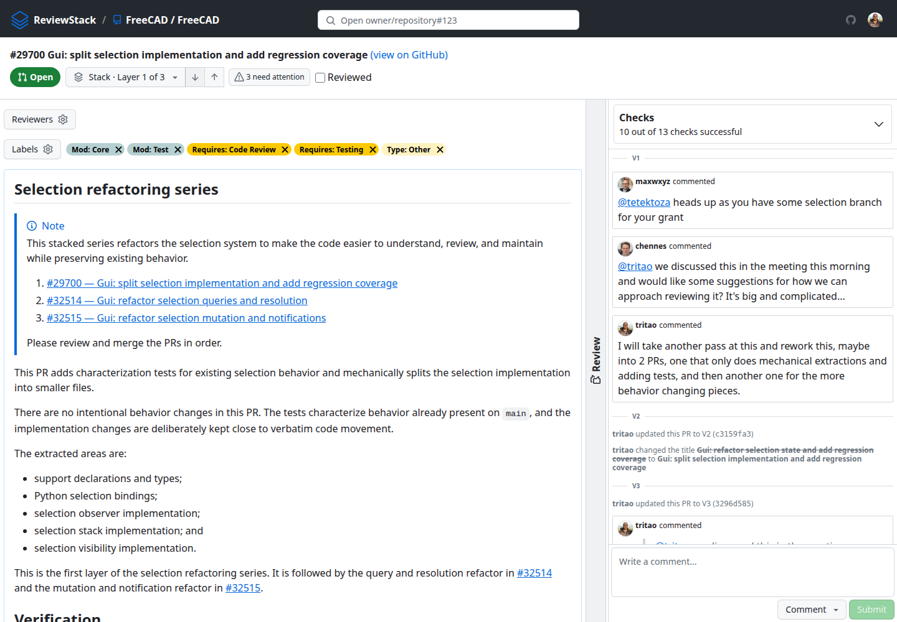
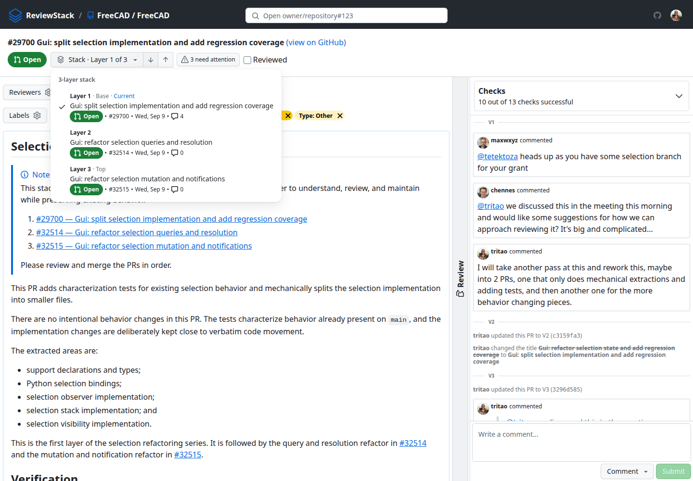
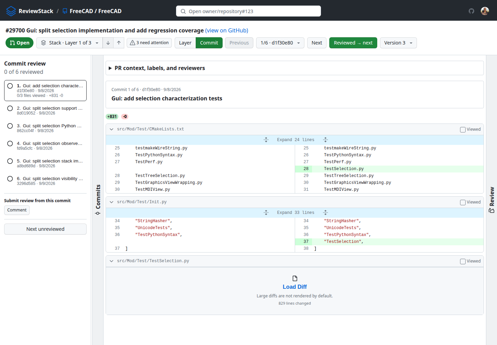
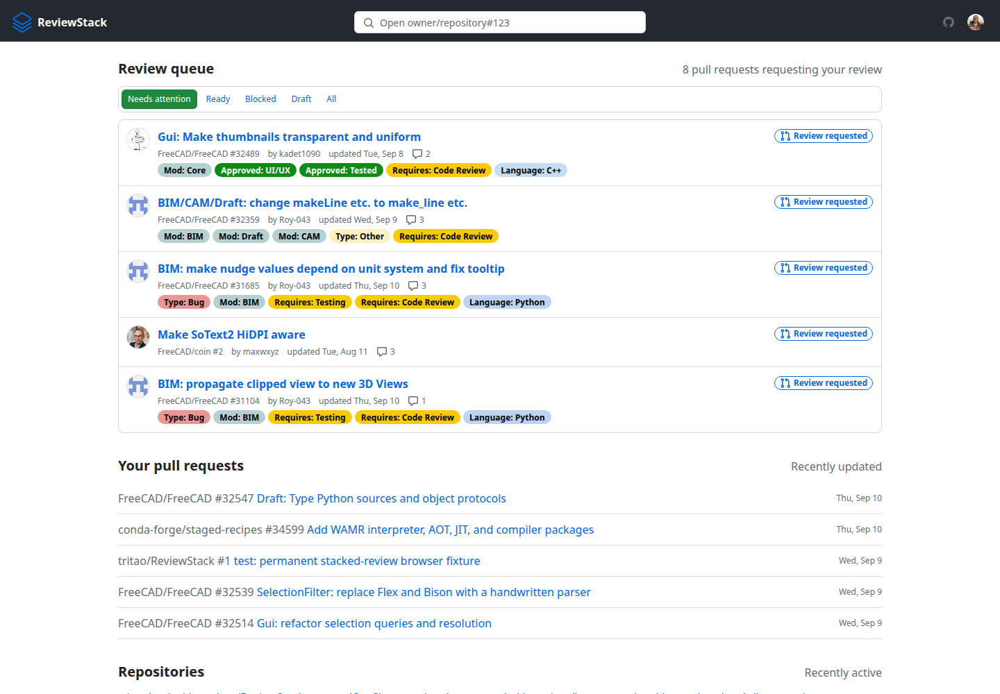
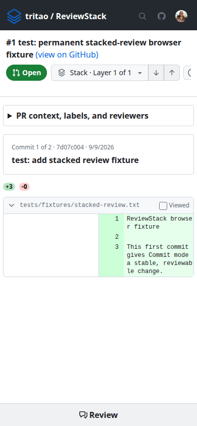

# ReviewStack for FreeCAD

[](https://github.com/tritao/ReviewStack/actions/workflows/pages.yml)

> Review chained FreeCAD pull requests as one coherent change. ReviewStack
> shows each stack layer independently, lets you review commit by commit, and
> remembers where you left off.

**Live deployment:** <https://tritao.github.io/ReviewStack/> · **Source:**
<https://github.com/tritao/ReviewStack>



ReviewStack is a client-side GitHub review workspace for maintainers who work
with stacked or chained pull requests. It was originally developed as part of
[Meta's Sapling repository](https://github.com/facebook/sapling); this fork adds
first-class support for [devstack](https://github.com/tritao/devstack) stacks,
including stacks published from forks.

## Why use it for FreeCAD?

GitHub's ordinary pull request view presents a stacked series as a cumulative
change. That makes a lower layer appear again in every PR above it, obscures
the intent of individual commits, and makes it easy to lose review progress.

ReviewStack addresses that workflow directly:

1. Open the PR you were asked to review.
2. Choose the layer and see the change relative to its adjacent layer.
3. Switch to Commit mode when you need to review intent and implementation
   separately.
4. Leave comments, mark files and commits as reviewed, then submit the review
   from the same workspace.

## What this fork adds

### Stack-aware review

- Reads hidden devstack metadata from the raw pull request body.
- Shows the complete stack with explicit `Base`, `Current`, and `Top` context.
- Keeps stack navigation in publish order, with previous/next controls.
- Computes adjacent-layer diffs for cross-fork chained PRs instead of showing
  the same cumulative `main..head` change repeatedly.
- Preserves the selected version, layer, mode, and commit in shareable URLs.



### Commit-by-commit review

- Reviews one commit and its files at a time.
- Keeps the commit headline, extended message, SHA, and date visible while
  reviewing its diff.
- Tracks file and commit progress and prevents finishing a commit early.
- Supports comments and GitHub review submission from Commit mode.
- Provides keyboard navigation for files, commits, and stack layers.



### Review continuity

- Preserves unfinished review comments across reloads and navigation.
- Offers a `Continue reviewing` section for partially completed reviews.
- Remembers reviewed files and commits in the browser.
- Retries failed diff files independently and supports cancellation.

### Maintainer dashboard

- Prioritizes pull requests in a review queue.
- Filters the queue by needs attention, ready, blocked, draft, or all.
- Shows authors, labels, comment counts, review decisions, merge conflicts,
  and recent activity at a glance.
- Links directly to your pull requests and active repositories.



### Large and unusual diffs

- Renders large diffs with virtualization so off-screen files do not block the
  review.
- Calculates diff statistics off the main thread.
- Handles binary, renamed, unavailable, mode, submodule, and large files with
  explicit status and actions.
- Keeps the review workspace usable on narrow screens.



## Quick start

1. Open <https://tritao.github.io/ReviewStack/>.
2. Sign in with GitHub, or choose token login when using GitHub Enterprise or
   private repositories.
3. Open a pull request URL, for example:

   ```text
   https://tritao.github.io/ReviewStack/FreeCAD/FreeCAD/pull/29700
   ```

4. Select `Layer` for the stack-level change or `Commit` for guided,
   commit-by-commit review.

## Devstack integration

Devstack publishes a hidden comment in each pull request body. Version 2 of
the metadata records the exact commits owned by every layer:

```html
<!-- DEVSTACK:REVIEWSTACK {"version":2,"current":32515,"stack":[{"number":32515,"commits":["0123456789abcdef0123456789abcdef01234567"]},{"number":32514,"commits":["89abcdef0123456789abcdef0123456789abcdef"]}]} -->
```

GitHub hides this comment in the rendered PR description. ReviewStack reads the
raw body through the GitHub API and validates that the stack order, current PR,
and full commit SHAs are consistent. Malformed or stale metadata produces an
actionable validation message instead of silently showing the wrong diff.

In a configured devstack worktree, inspect and publish metadata with:

```bash
ds stack-status
ds stack-doctor
ds gh-sync --plan .devstack/gh-sync-plan.json
ds gh-sync --apply-plan .devstack/gh-sync-plan.json
```

Review the generated plan before applying it because `--apply-plan` updates
GitHub.

## Run locally

Requirements:

- Node.js 20 or newer
- Corepack and Yarn 1
- A modern browser with SharedWorker and IndexedDB support
- A GitHub login or personal access token

```bash
git clone https://github.com/tritao/ReviewStack.git
cd ReviewStack
corepack enable
yarn install --frozen-lockfile
npm ci --prefix mcp-worker
yarn start
```

Open <http://localhost:3000>, paste a GitHub token when prompted, then navigate
to a pull request such as:

```text
http://localhost:3000/FreeCAD/FreeCAD/pull/29700
```

For a production build:

```bash
yarn build
yarn check:bundle-size
npx serve -s reviewstack.dev/build
```

ReviewStack has no application server. GitHub data and the token are stored in
the browser for the serving origin. Use **Logout** before reusing that origin
for an unrelated application.

## GitHub OAuth login

The hosted app can show a **Sign in with GitHub** button backed by the
stateless Cloudflare Worker in `oauth-worker/`. The browser uses the OAuth
authorization-code flow with PKCE and validates `state`; the worker performs
only the token exchange, so the GitHub client secret is never included in the
Pages bundle. Tokens remain in the browser and are not stored by the worker.

One-time deployment setup:

1. Register a GitHub OAuth App with homepage
   `https://tritao.github.io/ReviewStack/` and callback URL
   `https://tritao.github.io/ReviewStack/auth/callback`.
2. From `oauth-worker/`, authenticate Wrangler and set `GITHUB_CLIENT_ID` and
   `GITHUB_CLIENT_SECRET` with `npx wrangler secret put NAME`, then run
   `npx wrangler deploy`.
3. Add repository Actions variables `REVIEWSTACK_OAUTH_CLIENT_ID` and
   `REVIEWSTACK_OAUTH_TOKEN_ENDPOINT` (the deployed Worker's `/token` URL),
   then rebuild Pages.
4. For automatic worker deployment, add `CLOUDFLARE_API_TOKEN` and
   `CLOUDFLARE_ACCOUNT_ID` as repository secrets and set the repository variable
   `CLOUDFLARE_WORKER_CI_ENABLED` to `true`.

Only the `public_repo` OAuth scope is requested. Manual token login remains
available for private repositories and GitHub Enterprise.

## Development

```bash
yarn test
yarn lint
yarn build
yarn prepare-pages
yarn playwright install chromium
yarn test:e2e
```

The repository contains:

- `reviewstack/` — review UI and GitHub data model
- `reviewstack.dev/` — standalone browser shell and production build
- `shared/` — shared diff, drawer, keyboard, and TextMate utilities
- `textmate/` — grammar generation support

TextMate grammar artifacts are checked in. Ignored GraphQL types and the
TextMate WASM runtime are prepared automatically before start, test, and build.

The hosted build restricts API connections to GitHub, the OAuth worker, and the
MCP worker. Deployments for GitHub Enterprise must set
`REACT_APP_CSP_CONNECT_SRC` to a space-separated list containing the Enterprise
API and OAuth origins (and the MCP origin when the setup page is enabled).

## ChatGPT Web integration

The `mcp-worker/` service exposes ReviewStack as a read-only MCP app
for ChatGPT Web. This lets a user sign in to ChatGPT with an existing Plus
subscription and ask ChatGPT to review a pull request without putting an
OpenAI API key in ReviewStack. The service performs a separate GitHub OAuth
flow, retrieves bounded PR/stack/diff context, and exposes it to ChatGPT;
there are no GitHub write tools in the initial version.

See [`mcp-worker/README.md`](mcp-worker/README.md) for deployment and ChatGPT
connection instructions, or open the hosted [MCP setup guide](https://tritao.github.io/ReviewStack/mcp)
for the interactive checklist and worker health status. After the D1-backed
review workspace is enabled, authorized users can browse saved drafts at
`https://tritao.github.io/ReviewStack/reviews`.

The browser smoke test verifies the login and OAuth callback routes. In CI it
uses the workflow's short-lived, read-only `GITHUB_TOKEN` to exercise the
permanent fixture PR's Layer and Commit modes. For a local authenticated run,
set `REVIEWSTACK_E2E_GITHUB_TOKEN` to a token that can read this repository.

## Security and privacy

ReviewStack runs in the browser and does not proxy repository contents through
an application server. Tokens and fetched GitHub data stay in the browser's
storage for the serving origin. The OAuth worker exchanges authorization codes
but does not persist tokens. Log out before sharing or repurposing a browser
profile.

## Relationship to upstream

The initial standalone snapshot was extracted from
[`facebook/sapling`](https://github.com/facebook/sapling) commit
`2c9466e07b0cc5e18c99ae72fa9fafe818475289`. This repository is an independent,
FreeCAD-oriented fork and is not an official Meta or Sapling project.

## License

MIT. See [LICENSE](LICENSE).
