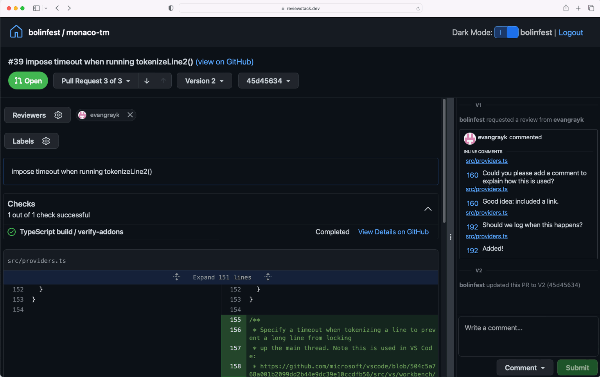

# ReviewStack for devstack

This repository packages [ReviewStack](https://sapling-scm.com/docs/addons/reviewstack)
as a standalone application and adds first-class support for
[devstack](https://github.com/tritao/devstack) stacked pull requests. It is
intended for FreeCAD maintainers and other projects that publish chained GitHub
PRs from forks.

ReviewStack is a client-side GitHub review application originally developed as
part of [Meta's Sapling repository](https://github.com/facebook/sapling). This
fork retains the upstream MIT license and the original source headers.



## What this fork adds

- Native hidden devstack metadata, including exact per-layer commit lists.
- Layer and commit-by-commit review modes.
- Adjacent-layer diffs for cross-fork chained PRs instead of cumulative
  `main..head` changes.
- Shareable URL state for the selected version, mode, and commit.
- Accurate off-thread diff statistics, bounded worker caches, cancellation,
  and explicit binary, rename, mode, submodule, and unavailable-file status.
- Reliable IndexedDB cleanup across tabs and workers on logout.
- Actionable validation errors for stale or malformed stack metadata.

## Requirements

- Node.js 20 or newer
- Corepack/Yarn 1
- A modern browser with SharedWorker and IndexedDB support
- A GitHub personal access token, or a token from `gh auth token`

## Run locally

```bash
git clone https://github.com/tritao/ReviewStack.git
cd ReviewStack
corepack enable
yarn install --frozen-lockfile
yarn start
```

Open <http://localhost:3000>. Paste a GitHub token when prompted, then navigate
to a URL such as:

```text
http://localhost:3000/FreeCAD/FreeCAD/pull/29700
```

For a production build:

```bash
yarn build
npx serve -s reviewstack.dev/build
```

ReviewStack has no application server. GitHub data and the token are stored in
the browser for the serving origin. Use **Logout** before reusing that origin
for an unrelated application.

## Devstack metadata

Devstack publishes a hidden PR-body comment. Version 2 records the exact
commits owned by every layer:

```html
<!-- DEVSTACK:REVIEWSTACK {"version":2,"current":32515,"stack":[{"number":32515,"commits":["0123456789abcdef0123456789abcdef01234567"]},{"number":32514,"commits":["89abcdef0123456789abcdef0123456789abcdef"]}]} -->
```

GitHub hides the comment in the rendered PR description. ReviewStack reads the
raw body through the GitHub API. Stack order is top-to-bottom, `current` must
occur exactly once, and every commit ID must be a full lowercase 40-character
SHA.

In a configured devstack worktree, validate and publish metadata with:

```bash
ds stack-status
ds stack-doctor
ds gh-sync --plan .devstack/gh-sync-plan.json
ds gh-sync --apply-plan .devstack/gh-sync-plan.json
```

Review the generated plan before applying it because `--apply-plan` updates
GitHub.

## Development

```bash
yarn test
yarn lint
yarn build
```

The workspace contains:

- `reviewstack/` — review UI and GitHub data model
- `reviewstack.dev/` — standalone browser shell and production build
- `shared/` — shared diff, drawer, keyboard, and TextMate utilities
- `textmate/` — grammar generation support

Generated GraphQL and TextMate artifacts are checked in. When their sources
change, use the package-specific `codegen` and `textmate` scripts before
committing.

## Relationship to upstream

The initial standalone snapshot was extracted from `facebook/sapling` commit
`2c9466e07b0cc5e18c99ae72fa9fafe818475289`, including the devstack-focused
patch series developed on top of ReviewStack. This repository is not an
official Meta or Sapling project.

## License

MIT. See [LICENSE](LICENSE).
